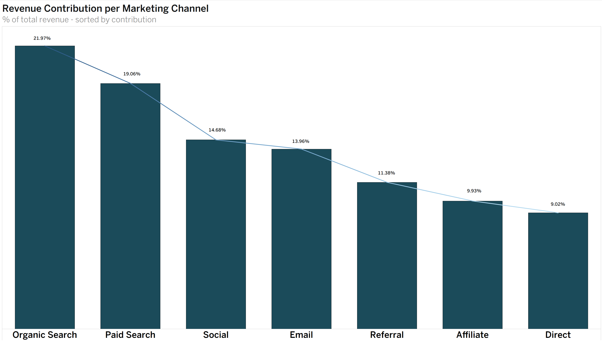

# Stryde E-Commerce Marketing Analysis 

## Client Background 

Stryde is a US-based e-commerce retailer that specializes in Ftiness and Lifestyle prdocucts. It's products fall into eight different categories; Fitness, Audio, Electronics, Home/Kitchen, Apparel, Beauty/Personal Care, Books/Media, and Office Supplies. Stryde was founded in 2024 and was built with a focus on performance-driven consumers, and in recent years has expanded it's catalouge to serve an extensive realm of lifestyle products while maintaining it's identity as a premium fitness brand. 

As of 2026, Stryde has processed over 10,000 transactions and has generated approaching $1.2m in sales revenue. The recent expansion has brought up many questions regarding the performance of it's marketing channels. 

This analysis was conducted in response to a brief from senior stakeholders and presents findings and recommendations across three teams - Marketing, Finance, and Operations. The core question driving the analysis is wether Stryde's current marketing investment reflects the quality of customer's each channel acquries, and where budget reallocation could drive stronger long term returns. Additional findings and recommendations relevant to the Finance and Operations teams where attention is warranted, is also included. 

## Business Question

*Which marketing channels are acquiring Stryde's highest value customers, and are we investing in them proportionally?*

### Northstar Metrics 

To evaluate channel quality and accurately identify high value customer acquisition, the following metrics/dimensions were defined as the primary measures of performance:

- **Marketing Channels**: Revenue Contribution, AOV, Return Rate (Operation/Behavioral), Cancellation Rate, Revenue Lost to Returns, AVG Rating 

- **Financial**: Revenue Contribution, Revenue Lost to Returns, Categorical Revenue Concentration 

- **Operational**: Cancellation Rate, Operational Return Rate, Behavioral Return Rate

# Executive Summary 

