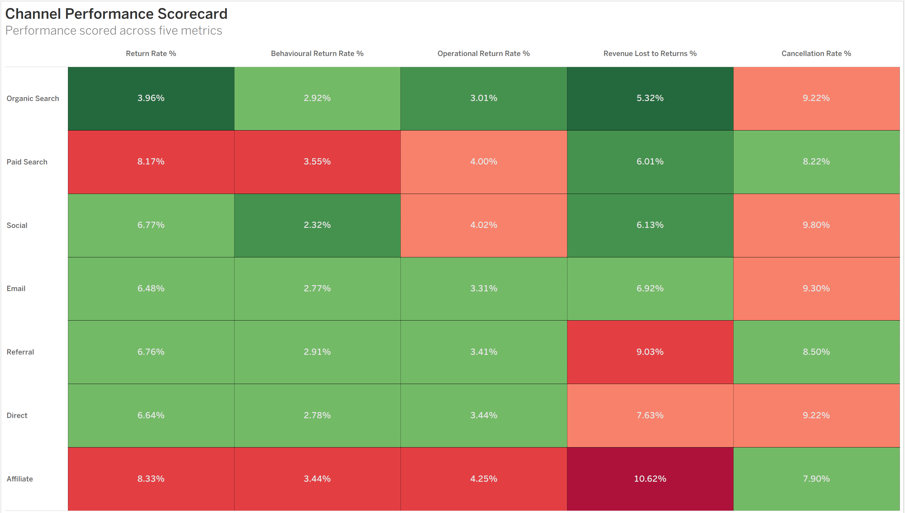
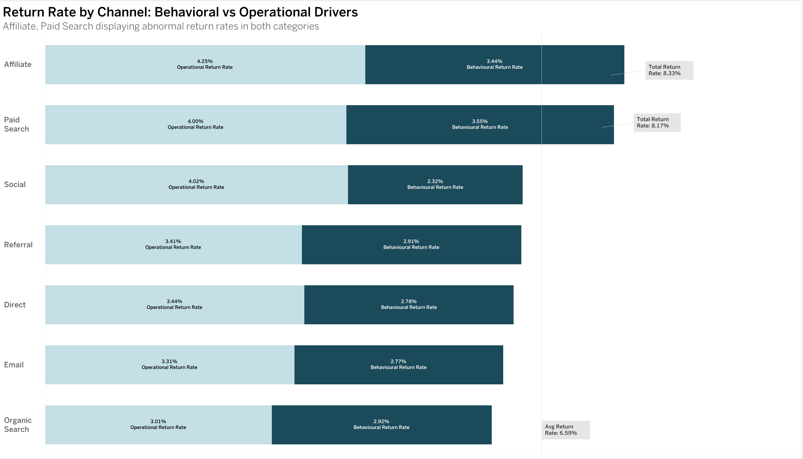

# Stryde E-Commerce Marketing Analysis 

## Client Background 

Stryde is a US-based e-commerce retailer that specializes in Ftiness and Lifestyle prdocucts. It's products fall into eight different categories; Fitness, Audio, Electronics, Home/Kitchen, Apparel, Beauty/Personal Care, Books/Media, and Office Supplies. Stryde was founded in 2024 and was built with a focus on performance-driven consumers, and in recent years has expanded it's catalouge to serve an extensive realm of lifestyle products while maintaining it's identity as a premium fitness brand. 

As of 2026, Stryde has processed over 10,000 transactions and has generated approaching $1.2m in sales revenue. The recent expansion has brought up many questions regarding the performance of it's marketing channels. 

This analysis was conducted in response to a brief from senior stakeholders and presents findings and recommendations across three teams - Marketing, Finance, and Operations. The core question driving the analysis is wether Stryde's current marketing investment reflects the quality of customer's each channel acquries, and where budget reallocation could drive stronger long term returns. Additional findings and recommendations relevant to the Finance and Operations teams where attention is warranted, is also included. 

## Business Question

*Which marketing channels are acquiring Stryde's highest value customers, and are we investing in them proportionally?*

### Northstar Metrics 

To evaluate channel quality and accurately identify high value customer acquisition, the following metrics/dimensions were defined as the primary measures of performance:

- **Marketing Channels**: Revenue Contribution, AOV, Return Rate (Operation/Behavioral), Cancellation Rate, Revenue Lost to Returns, AVG Rating 

- **Financial**: Revenue Contribution, Revenue Lost to Returns, Categorical Revenue Concentration 

- **Operational**: Cancellation Rate, Operational Return Rate, Behavioral Return Rate

# Executive Summary 

### - Channel Revenue Contribution                                                                                          
  - Over 40% of the revenue contribution derives from Organic Search (**21.97%**) and Paid Search (**19.06%**)                 
  - Secondary channels such as Social (**14.68%**) and Email (**13.96%**) also contribute meaningfully.
  - Referral, Affiliate and Direct channels make up smaller portions of overall revenue (< **11.5%**).                         

### - Limitations of Revenue as a Performance Metric  
  - Revenue contribution reflects volume, not necesarrily quality.
  - Lower contributing channels still generate a prominent portion of revenue (**~35% combined**).
  - Key factors such as: AOV, return rates (revenue lost), revenue after losses need to accounted for.

 ### - Emerging Questions
   - Are top performing channels driving high value/loyal customers or just transactions?
   - And do these channels posess holes in the transaction process leading to potential revenue loss?
   - Are lower-volume channels undervalued, potentially hurting us in the long run?

# Channel Performance Deep Dive 

 

### A note on AVG Rating:
   - Average customer rating across all channels falls withing a narrow range of **3.84-4.03**. Indicating consistent customer satisfaction regardless of the acquisition channel. This metric does not surface meaningful differentation of quality between channels. Hence, it was excluded as a performance indicator.
### Return Rates (Behavioral + Operational):
#### Paid Search
  - Paid Search is the second highest performing channel in terms of revenue contribution, but is also the second highest channel in terms of return rate (**8.17%**). At first glance this signals a satisfaction issue. However, it's revenue lost to returns sits at **6.01%** - below the channel average.
  - This is explained by Paid Search having the highest AOV at **$71.43**. Which allows the revenue base to absorb the leakage caused by the returns. The dollar impact of the returns is not the issue here, rather what this signals. Customers arriving through paid search are not recieving what they expected, which can have negative long term consequences affecting customer loyalty, and increasing customer churn.
#### Affiliate
  - Affiliate sits close to the bottom for revenue contribution and has the highest return rate (**8.33**%).
  - On top of that, it posesess the highest revenue lost to returns (**10.62%**), highest amongst all channels.
  - Affiliate's operational and behavioural return rates split is consistent with other channels, meaning the issue isn't contributed to one root cause. However, both figures sit at the top suggesting fulfillment quality and customer satisfaction issues.
  - Low revenue generation + High revenue leakage, clear candidate for budget reallocation.
### Referral, Direct   
  - Referral and Direct both pose an interestign situation. Operational and behavioural return rates of both channels comfortably sit in the green. However, both posess a elevated revenue lost to returns sitting at **9.03%** and **7.63%**.
  - The pinpoint of this cannot be derived from the data alone, and the rate could be high due to low revenue bases to begin with. The absence of clear return reasons may reflect data limitations. Customer's not providing feedback, making it difficult to isolate a root cause.
  - Regardless, the combination of low revenue contribution and elevated leakage suggest both channels are less effcient than their return metrics suggest. Improved return reason capture would help us determine wether this is due to product satisfaction or fulfillment issues.
### Social 
  - Social has the lowest behavioural return rate (**2.32%**) but it's operational return rate is an issue (**4.02%, the second highest**).  
