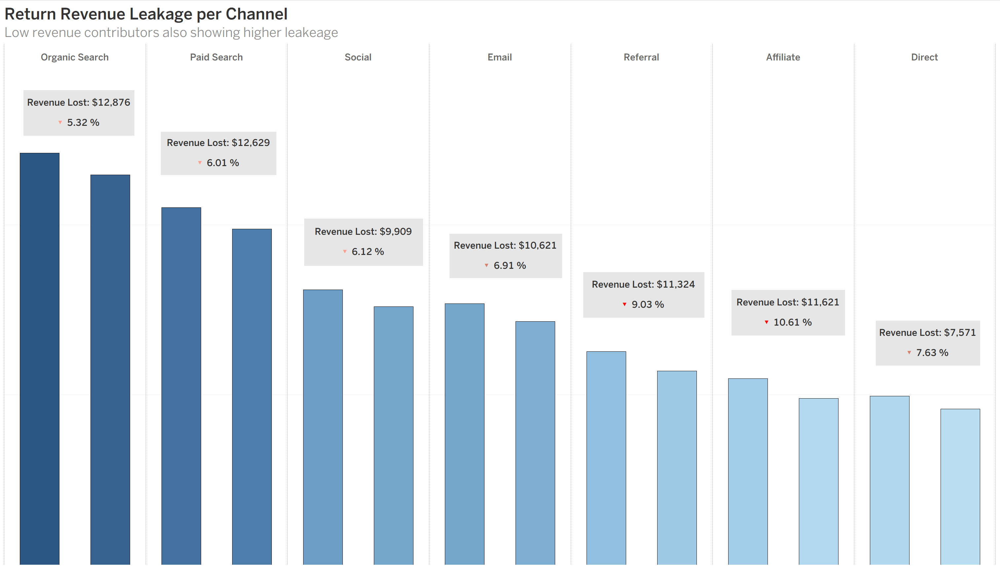
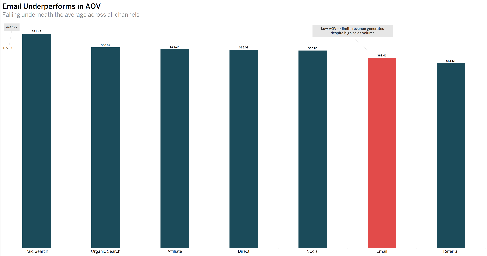
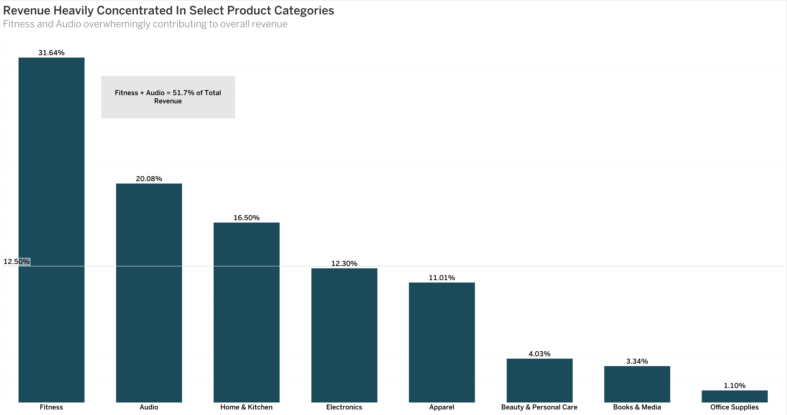
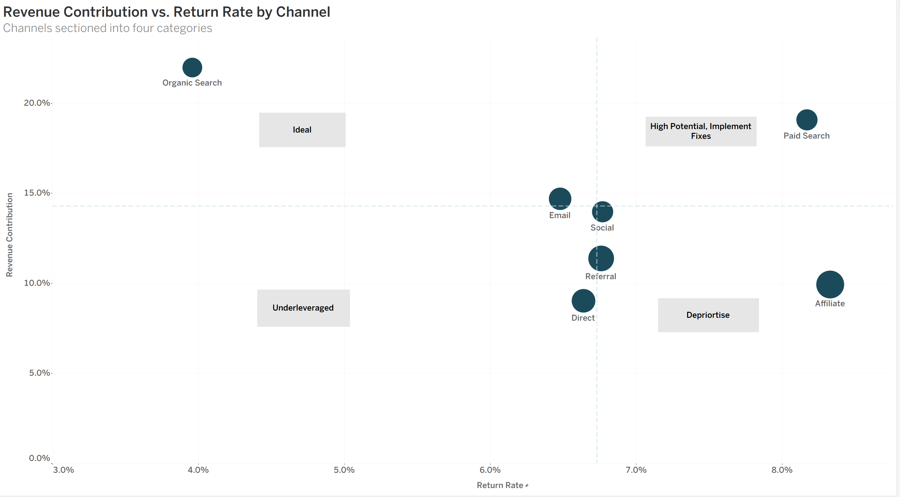

# Stryde E-Commerce Marketing Analysis 

## Client Background 

Stryde is a US-based e-commerce retailer that specializes in Ftiness and Lifestyle prdocucts. It's products fall into eight different categories; Fitness, Audio, Electronics, Home/Kitchen, Apparel, Beauty/Personal Care, Books/Media, and Office Supplies. Stryde was founded in 2024 and was built with a focus on performance-driven consumers, and in recent years has expanded it's catalouge to serve an extensive realm of lifestyle products while maintaining it's identity as a premium fitness brand. 

As of 2026, Stryde has processed over 10,000 transactions and has generated approaching $1.2m in sales revenue. The recent expansion has brought up many questions regarding the performance of it's marketing channels. 

This analysis was conducted in response to a brief from senior stakeholders and presents findings and recommendations across three teams - Marketing, Finance, and Operations. The core question driving the analysis is wether Stryde's current marketing investment reflects the quality of customer's each channel acquries, and where budget reallocation could drive stronger long term returns. Additional findings and recommendations relevant to the Finance and Operations teams where attention is warranted, is also included. 

## Business Question

*Which marketing channels are acquiring Stryde's highest value customers, and are we investing in them proportionally?*

### Northstar Metrics 

To evaluate channel quality and accurately identify high value customer acquisition, the following metrics/dimensions were defined as the primary measures of performance:

- **Marketing Channels**: Revenue Contribution, AOV, Return Rate (Operation/Behavioral), Cancellation Rate, Revenue Lost to Returns, AVG Rating 

- **Financial**: Revenue Contribution, Revenue Lost to Returns, Categorical Revenue Concentration 

- **Operational**: Cancellation Rate, Operational Return Rate, Behavioral Return Rate

# Executive Summary 

### - Channel Revenue Contribution                                                                                          
  - Over 40% of the revenue contribution derives from Organic Search (**21.97%**) and Paid Search (**19.06%**)                 
  - Secondary channels such as Social (**14.68%**) and Email (**13.96%**) also contribute meaningfully.
  - Referral, Affiliate and Direct channels make up smaller portions of overall revenue (< **11.5%**).                         

### - Limitations of Revenue as a Performance Metric  
  - Revenue contribution reflects volume, not necesarrily quality.
  - Lower contributing channels still generate a prominent portion of revenue (**~35% combined**).
  - Key factors such as: AOV, return rates (revenue lost), revenue after losses need to accounted for.

 ### - Emerging Questions
   - Are top performing channels driving high value/loyal customers or just transactions?
   - And do these channels posess holes in the transaction process leading to potential revenue loss?
   - Are lower-volume channels undervalued, potentially hurting us in the long run?

# Channel Performance Deep Dive 
## Return Rates are the primary differentiator between high and low quality channels.

 

### A note on AVG Rating:
   - Average customer rating across all channels falls withing a narrow range of **3.84-4.03**. Indicating consistent customer satisfaction regardless of the acquisition channel. This metric does not surface meaningful differentation of quality between channels. Hence, it was excluded as a performance indicator.
### Return Rates (Behavioral + Operational):
#### Paid Search
  - Paid Search is the second highest performing channel in terms of revenue contribution, but is also the second highest channel in terms of return rate (**8.17%**). At first glance this signals a satisfaction issue. However, it's revenue lost to returns sits at **6.01%** - below the channel average.
  - This is explained by Paid Search having the highest AOV at **$71.43**. Which allows the revenue base to absorb the leakage caused by the returns. The dollar impact of the returns is not the issue here, rather what this signals. Customers arriving through paid search are not recieving what they expected, which can have negative long term consequences affecting customer loyalty, and increasing customer churn.
#### Affiliate
  - Affiliate sits close to the bottom for revenue contribution and has the highest return rate (**8.33**%).
  - On top of that, it posesess the highest revenue lost to returns (**10.62%**), highest amongst all channels.
  - Affiliate's operational and behavioural return rates split is consistent with other channels, meaning the issue isn't contributed to one root cause. However, both figures sit at the top suggesting fulfillment quality and customer satisfaction issues.
  - Low revenue generation + High revenue leakage, clear candidate for budget reallocation.
#### Referral, Direct   
  - Referral and Direct both pose an interestign situation. Operational and behavioural return rates of both channels comfortably sit in the green. However, both posess a elevated revenue lost to returns sitting at **9.03%** and **7.63%**.
  - The pinpoint of this cannot be derived from the data alone, and the rate could be high due to low revenue bases to begin with. The absence of clear return reasons may reflect data limitations. Customer's not providing feedback, making it difficult to isolate a root cause.
  - Regardless, the combination of low revenue contribution and elevated leakage suggest both channels are less effcient than their return metrics suggest. Improved return reason capture would help us determine wether this is due to product satisfaction or fulfillment issues.
#### Social 
  - Social has the lowest behavioural return rate (**2.32%**) but it's operational return rate is an issue (**4.02%, the second highest**). Customers acquired through this channel are satisfied with what they recieve, but there is fulfillment issues which need to be evaluated.
### Cancellation Rates:  
  - Social, Email, Organic Search, and Paid Search have the highest cancellation rates. However, the range is quite tight amongst all channels (**7.90%-9.80%**) with Social at the top.
  - The root cause of the cancellations cannot be fully determined from the available data alone.
  - Post-cancellation feedback would be needed to identify the driver of these cancellations and for a reduction strategy. 
# Revenue Leakage, Bottom-Line Impact
## Return rates highlight behavioral and operational inefficiences. However, they do not fully capture the financial impact of these issues.

- High volume channels such as Organic Search (**$12.8k**) and Paid Search (**$12.6k**)(**Total: $25.4K**)contribute the largest revenue losses, but this is primarily due to scale rather than inefficiency, hence why their revenue lost to returns is low.
- Lower contributing channels exhibit signficantly higher leakage rates; Affiliate (**$11.6k**), Direct (**$7.5k**), Referral (**$11.3k**)(**Total: $30.4k**)
- Mid tier channels like Social and Email show moderate leakage (**Total: $20.5k**). Indicating a balance between value and risk.

- Smaller channels are underperforming in both dimensions, they generate the least amount of revenue and lose the largest proportion of it. Making it clear there are inefficienes in these acquisition sources.

  # AOV Disparities Limiting Revenue Potential
  ## Stronger channels are not performing as strongly as they could due to AOV hindrance, leaving revenue on the table.

  

  - Almost every channel meets the average AOV (**$65.93**) other than Email (**$63.41**) and Referral (**$61.61**).
  - Inital thoughts may be that Referral's AOV is lower due to the discount codes/referral links. However, it has one of the lowest coupon/discount applied rates, suggesting customers acquired through Referral simply may not be spending.
  - Email is where the real anomaly occurs. It's mid tier counter part Social basically meets the average, while Email is lagging behind by **$2.39**. Which may not seem like much, but at the revenue contribution Email brings, this could be the difference of thousands of dollars.
  - AOV is where paid search is able to make up for it's revenue lost to returns. Sitting at the top of all channels and **$5.50** above the average this is where the Paid Search channel shines, and proves that a strong AOV could make up for other lagging areas.
  - However, the lagging areas for Affiliate, Direct, and Referral are too large and their AOV isn't strong enough to make up for it.

 # New Product Categories Catching Up 
 ## Stryde's expansion is showing early signs of growth, and with time may be on par with Fitness and Audio.

 

 - The fitness and product categories make up a little over half of the revenue generated (**51.7%**).
 - Home & Kitchen, Electronics, and Apparel make up for close to **40%** of the revenue generated showing strong signs they may be on par with Fitness and Audio given time.
 - Lower ticket categories like Beauty, Books/Media, and Office Supplies are severly lagging behind making up a mere **8%** of total revenue.

# Are We Investing Proportinally?
## Given the evidence across multiple performance dimensions allows us to roughly categorize each channel into four strategic quadrants.

- The evidence across the board shows Organic Search is a very strong channel with no prominent red flags, putting it into a category of it's own.
- Paid search has a lot of potential, but has issues that cannot be ignored. It's AOV makes up for that issue, but if it's AOV were to drop it could pose problems that significantly decrease the quality of this channel.
- Affiliate falls into depriortise due to it's weak performance across multiple metrics. It doesn't possess any redeeming qualities that can make up for it's lack of performance hence, why it falls into this quadrant.
- Direct has some complications which need to be addressed, but if dealt with correctly could become a high quality channel which is currently being overlooked.
- Email, Social, and Referral all fall into a mix of quadrants which require more nuance to fully disect and assign.

# Recommendations 

## Overall:
- The marketing channels acquiring the highest value customers are; Organic Search, Paid Search, Social and Email.
- If we zoom out for a moment, the overall trend shows that the lower we get in revenue contribution the less valuable the customers being obtained are.
- However, certain channels in the lower revenue contribution range can potentially provide a lot of value if handled correctly.
- But, the lower we go down the ladder the more weaknesses the sources show. Low AOV's, high return rates, high amounts of revenue leakage, etc.

#### Tier 1 - Underinvested 

### Organic Search
- Stryde's strongest channel operates at a near zero acquisition cost, yet generates the highest revenue contribution. Investment here is not about directly paying for traffic. Rather, through content and SEO services.
  ## Marketing:
    - Increase investment towards SEO services and producing more and higher content to improve search rankings.
    - Focus on building brand authority through content.
    - Organic growth will pay off through driving website traffic, and customer loyalty.

### Direct 
- This is the sleeper channel of the bunch. Customers acquired through Direct marketing have little to no spend attached to them and don't possess the same severity of issues like the other channels that contribue low revenue contribution.
  ## Marketing:
    - Direct cannot be invested in the traditional sense. Growth here will be achieved through building the brand across every other touchpoint.
    - Focus on improving post purchase experience. Customers who have a good experience with their first ot first few purchases through other channels are more likely to come directly to the site down the line.
    - Invest in brand identity, awareness, and building a community around Stryde to build reputation and plant into the mind of consumers.
    - Implementing these changes could help increase the customers who come directly to the site, and overtime lower our acquisition costs.

---

#### Tier 2 - Overinvested  

### Paid Search
  - This could actually come as a surprisde to many. To be clear, Paid Search is not a bad marketing source it's actually the opposite. However, in comparison to Organic Search (which has almost no acquisition cost) it lags in performance and costs significantly more to maintain.
    ## Marketing, Finance:
      - If a channel which directly costs almost nothing is outperforming it, it's highly likely if the money invested into this channel was reallocated to Organic it would perform even better.
      - Continue investing in Paid Search, but we need to reduce that investment. Redirect this investment to Organic Search.
    ## Operations:
      - The strength of Paid Search's AOV does a lot of heavy lifting in making up for it's return rates. Investigate the root cause for the product returns, try to identify if it's due to packing issues, supplier defect or a completely different operational issue.

---

#### Tier 3 - Monitor & Improve 

### Email 
- Email generates strong order volume but is held back by it's low AOV.

  ## Marketing, Finance:
  - Introduce minimum spending thresholds to unlockl free shipping - incentivising customers to spend more.
  - Start bundling complementary products to naturally lift order value.
  - Introduce volume discounts to increase the quantity of item's purchased.

### Social 

  ## Operations:
  - Implement a pre shipment quality check to reduce the operation return rate.
  - Introduct a post cancellation response prompt with customer incentive to to help capture cancellation reasons. Helps address a current data limitation.

---

#### Tier 4 - Deprioritise 

### Referral & Associate 

  ## Marketing & Finance:
  - Highest return rates, highest revenue leakages, and no compensating strengths to soften the blow of these weaknesses.
  - Budget currently allocated to Affiliate and Referral should be reallocated to higher performing channels — specifically Organic Search and Email where the return on investment stronger.
  

    
    
